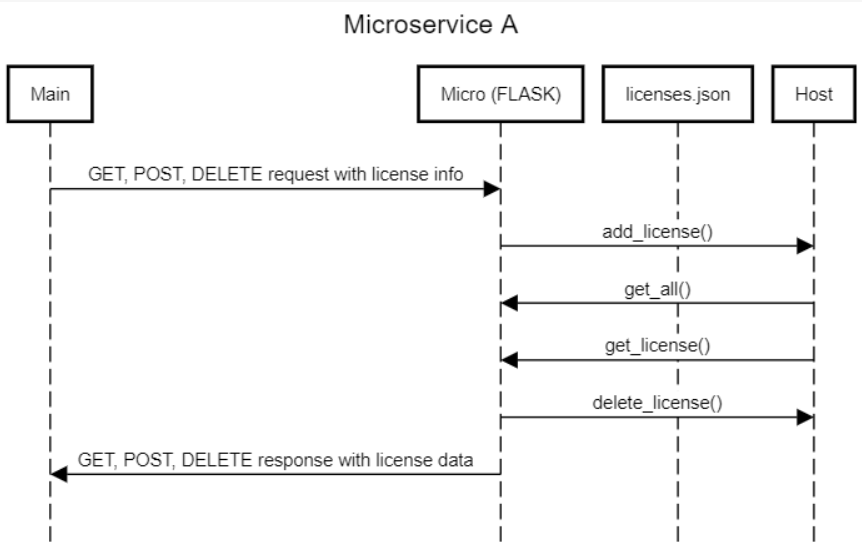

# CS361-Microservice-A

#REQUESTING

To make a request to the Flask microservice, you need to use the request command along with the proper method that you are using to handle your request. For example, if I want to add something to my local host, I would use "request.post()" in order to make a request to the microservice that would then write information to your local host server. You also need to make sure that you save the response info into a variable, as that is what we will use to tell us if the process finished successfully or not, and it will also contain the information that we requested.

EXAMPLE: 
response = requests.post(url, data)

Here, requests will send a request to the microservice with the post method. The two arguments in the call are the url of the server that the request will be made to, and the data is what we are posting to the server. It will return a status code, as well as the same info that we just sent to the microservice within response.

#RECEIVING

To receive the data from the microservice, we use return(jsonify(data)) within the microservice, which is what returns our data to the reponse variable in the main program. So, all of our requests and responses are handled within the one line above.

EXAMPLE:
WITHIN MICROSERVICE:
def get_license(data):
  for license in licenses:
    if "id" in license and license["id"] == license_id:
      return jsonify(license)

WITHIN MAIN PROGRAM:
response = requests.get(url, data)

From the main program, we made a get request, which tells the microservice it is running the GET operation. The microservice runs the operation, and then returns the json form of the data that we requested, which is then stored within the response variable in the main program.

